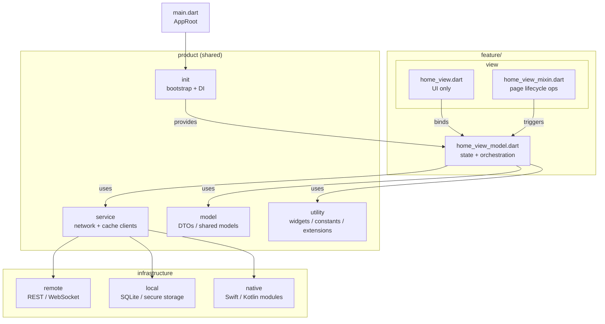

# Yusuf İhsan Görgel  
**Mobile Software Engineer** · Flutter · Swift · Kotlin  

I engineer **production-grade mobile apps** with a focus on **architecture**, **performance**, and **reliability**.  
Most of my senior work is **private (NDA)** — I optimize systems, ship releases, and keep apps stable at scale.

  
  
  

  
  
  
  
  
  

  
  
  

---

## What I focus on

**Architecture**
- Feature-first modularization (clear boundaries: UI ↔ domain ↔ data)
- Dependency inversion, testable business logic, replaceable infrastructure
- Predictable state modeling (tradeoff-driven, not framework-driven)

**Performance**
- Frame budget mindset (60/120fps), DevTools profiling, render discipline
- Jank avoidance: rebuild minimization, list perf, async scheduling, caching

**Native (iOS/Android)**
- Flutter ↔ native boundaries (platform channels / plugin-style isolation)
- Swift/Kotlin for device capabilities, performance-critical edges, and stability

**Reliability & delivery**
- Offline-first (caching + sync), resilient networking, retries/backoff
- CI, testing, versioning, reproducible builds, release discipline

---

## How I structure real apps (feature-first + product core)

This is the structure I use when I want **scale + clarity** without over-complicating things:

- `feature/<name>/` → screen/flow-specific code  
  - `view/` → **UI only** (no service calls inside widgets)  
  - `view/mixin/` → lifecycle / page ops (initial fetch, listeners, navigation glue)  
  - `view_model/` → state + orchestration  
- `product/` → shared building blocks used across features  
  - `init/` → bootstrap, DI, env, app-wide setup  
  - `service/` → networking + cache clients  
  - `model/` → shared DTOs / app models  
  - `utility/` → widgets, constants, extensions, helpers  

---

## Private work (NDA) — what I can say publicly

- Shipping and maintaining **multi-module mobile apps**
- Building **stable release pipelines** and reducing regression risk
- Performance work: **profiling**, **memory/CPU hotspots**, smooth UI
- Integrations: **auth / realtime / offline sync / payments** (context-dependent)

> If needed, I can publish anonymized “case-study” style writeups (no IP, no client data) as Markdown articles in this repo.

---

## Engineering proof (process > hype)

- **Code review discipline:** small PRs, clear diffs, rollback-friendly changes
- **Testing strategy:** unit-first for domain, targeted widget/integration tests
- **Observability mindset:** logs, crash signals, performance baselines
- **Documentation:** decisions recorded (ADR-style), onboarding-friendly structure

---

## Tech stack

**Mobile**
- Flutter (Dart), Swift (SwiftUI), Kotlin (Android)

**Backend (when needed)**
- Java (Spring Boot), Node.js (TypeScript), Go

**Data**
- SQLite / local persistence, PostgreSQL, MongoDB

**Engineering**
- REST, WebSocket, testing, CI/CD

---

## Contact

- Email: **developeryusuf@icloud.com**
- LinkedIn: https://linkedin.com/in/yusuf-ihsan-gorgel

---

> If it ships reliably, it’s engineered.
